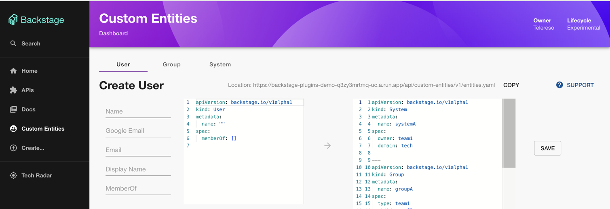

# Custom Entities



This plugin provide easy UI to add new entities (Users,Groups ...etc) by storing them and provide endpoints for catalog to consume them from

This is the front end plugin also check [Backend Plugin](../custom-entities-backend/README.md)

## Why this plugin

### First Deployment and Identity 
When setting up backstage for the first time it might be hard to digest everything at once and User/Group management and
other entities will need some time to get use to,  

Also when integrating with a new [Authentication Provider](https://backstage.io/docs/auth/) this plugin will be handy to add users quickly

### Custom/Limited Authentication Access

Some organisation when integrating with Github/Gitlab or other auth providers don't want to copy the entre org users and groups into backstage 
and provide access to everyone involved, 

This plugin will make it's easy to add/remove new users and groups without the need to maintain a git repo with all users and groups

Also will give a chance to re-organise the groups in case they don't match the hierarchy of the auth provider
 
### Blue Print Entities 
This plugin can be used to design all the org setup then quickly validate the result in backstage,
After that the resulted `custom-entities.yaml` can be committed to some repo and location for better control and provision 

## Demo
You can check a live demo of the plugin [here](https://backstage-plugins-demo-q3zy3mrtmq-uc.a.run.app/custom-entities)


## Installation

This is the front end plugin so make sure to setup the [Backend Plugin](../custom-entities-backend/README.md) as well

### Install the package

```bash
yarn --cwd packages/app add @telereso/backstage-plugin-custom-entities
```

### Adding the plugin to route `packages/app`

In your `packages/app/src/App.tsx` add the following changes

```diff
+import { CustomEntitiesPage } from '@telereso/backstage-plugin-custom-entities';

const app = createApp({
  apis,
  

const routes = (
  <FlatRoutes>
    /* other routes */
+   <Route path="/custom-entities" element={<CustomEntitiesPage />} />
  </FlatRoutes>
);

```

### Adding to sidebar navigation

In your `packages/app/src/compoenets/Root/root.tsx` add the following changes

```diff
+import SupervisedUserCircleSharpIcon from '@material-ui/icons/SupervisedUserCircleSharp';
import MenuIcon from '@material-ui/icons/Menu';
import SearchIcon from '@material-ui/icons/Search';

export const Root = ({ children }: PropsWithChildren<{}>) => (
  <SidebarPage>
    <Sidebar>
      <SidebarLogo />
      <SidebarGroup label="Search" icon={<SearchIcon />} to="/search">
        <SidebarSearchModal />
      </SidebarGroup>
      <SidebarDivider />
      <SidebarGroup label="Menu" icon={<MenuIcon />}>
        {/* Other Items and groups */}
        <SidebarItem icon={LibraryBooks} to="docs" text="Docs" />
+       <SidebarItem icon={SupervisedUserCircleSharpIcon} to="custom-entities" text="Custom Entities" />
        <SidebarItem icon={CreateComponentIcon} to="create" text="Create..." />
        {/* Other Items and groups */}
  </SidebarPage>
);

```


#### Admin Permission 

To only give access to admins for this plugin, you can make the following changes 

```bash
yarn --cwd packages/app add @telereso/backstage-plugin-custom-entities-common
yarn --cwd packages/backend add @telereso/backstage-plugin-custom-entities-common
```

Update `packages/app/src/compoenets/Root/root.tsx`

```diff
+import SupervisedUserCircleSharpIcon from '@material-ui/icons/SupervisedUserCircleSharp';
import MenuIcon from '@material-ui/icons/Menu';
import SearchIcon from '@material-ui/icons/Search';
+ import {customEntitiesAdministerPermission} from "@telereso/backstage-plugin-custom-entities-common";

export const Root = ({ children }: PropsWithChildren<{}>) => (
  <SidebarPage>
    <Sidebar>
      <SidebarLogo />
      <SidebarGroup label="Search" icon={<SearchIcon />} to="/search">
        <SidebarSearchModal />
      </SidebarGroup>
      <SidebarDivider />
      <SidebarGroup label="Menu" icon={<MenuIcon />}>
        {/* Other Items and groups */}
        <SidebarItem icon={LibraryBooks} to="docs" text="Docs" />
+        <RequirePermission
+            permission={customEntitiesAdministerPermission}
+            errorPage={<></>}>
+          <SidebarItem icon={SupervisedUserCircleSharpIcon} to="custom-entities" text="Custom Entities" />
+        </RequirePermission>
        <SidebarItem icon={CreateComponentIcon} to="create" text="Create..." />
        {/* Other Items and groups */}
  </SidebarPage>
);

```

then update your policy 


```diff
+import {customEntitiesUpdatePermission} from "@telereso/backstage-plugin-custom-entities-common"


const GROUP_BACKSTAGE_ADMINS = 'group:default/backstage-admins'

export class TestPermissionPolicy implements PermissionPolicy {
    async handle(request: PolicyQuery, user?: BackstageIdentityResponse,): Promise<PolicyDecision> {

        // Custom Entities
+        if (isPermission(request.permission, customEntitiesUpdatePermission)) {
+            if (user?.identity.ownershipEntityRefs.includes(GROUP_BACKSTAGE_ADMINS,)
+            ) {
+                return {result: AuthorizeResult.ALLOW};
+            }
+            return {result: AuthorizeResult.ALLOW};
+        }
        
        // Other permission

        return {result: AuthorizeResult.ALLOW};
    }
}
```
